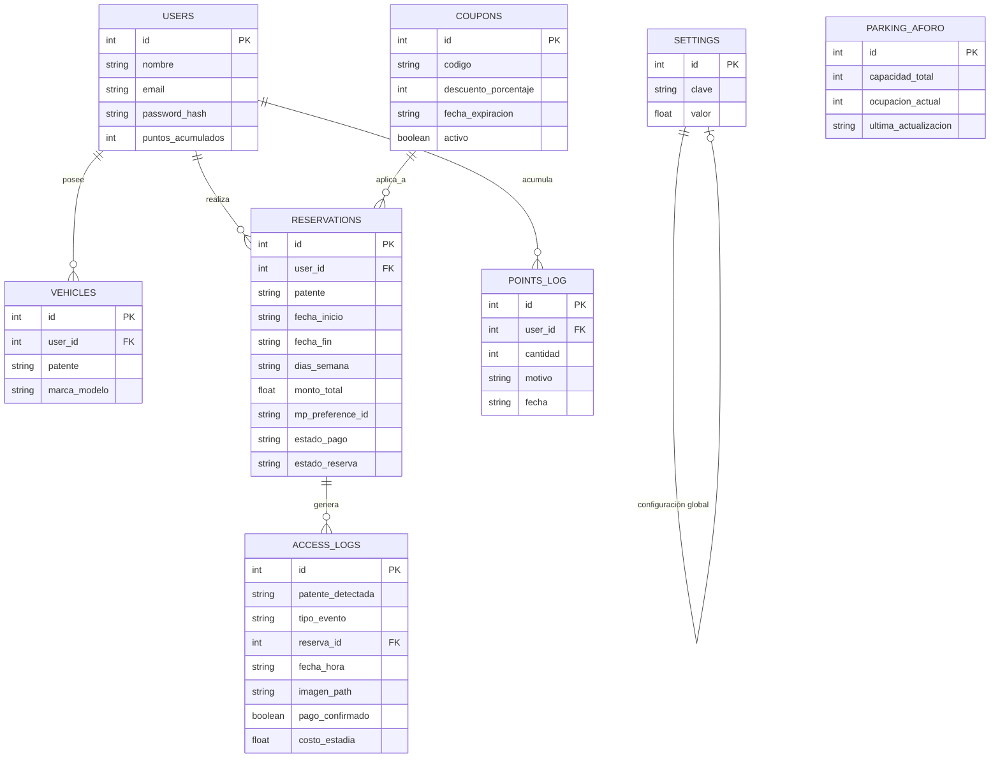
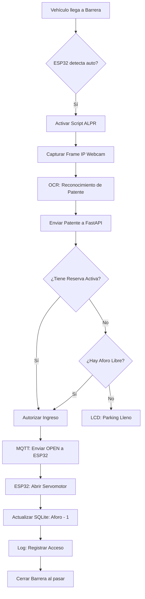

# 🗄️ Esquema de Base de Datos: ParkingTech (SQLite)

Este esquema está diseñado para SQLite y optimizado para el control de aforo por flujo y sistema de fidelización.

## 🧜‍♂️ Diagrama de Entidad-Relación (DER)

### 🔗 Explicación de las Relaciones

1.  **Usuarios y Vehículos (1:N)**: Un usuario puede registrar múltiples patentes (ej: auto personal, de pareja o de trabajo). Cada vehículo pertenece a un único usuario para vincular la "llave" de acceso al perfil que paga.
2.  **Usuarios y Reservas (1:N)**: Un usuario realiza múltiples reservas a lo largo del tiempo. Cada reserva guarda el `user_id` para gestionar el historial y los pagos de Mercado Pago.
3.  **Usuarios e Historial de Puntos (1:N)**: Cada transacción de puntos (ganancia o canje) genera un registro vinculado al usuario. El saldo en `users.puntos_acumulados` es la suma de este historial.
4.  **Cupones y Reservas (1:N)**: Un mismo código de cupón (ej: 'PROMO10') puede aplicarse a muchas reservas distintas, siempre que esté activo y dentro de su fecha de vigencia.
5.  **Reservas y Registros de Acceso (1:N)**: Un registro de acceso ALPR puede estar vinculado a una reserva (si el usuario reservó previamente) o ser nulo (si el usuario entró "al paso"). Un reserva puede tener múltiples accesos (entradas/salidas).
6.  **Aforo Global (Independiente)**: La tabla `parking_aforo` funciona como un contador maestro. Es actualizada por el Backend tras cada evento de entrada o salida exitosa detectado por las barreras.
7.  **Configuraciones (Independiente)**: La tabla `settings` almacena valores dinámicos como el precio por hora o multas.

---

## 🔄 Diagrama de Flujo: Proceso de Acceso (ALPR)

---

## 📊 Tablas del Sistema

### 1. Usuarios (`users`)
| Campo | Tipo | Descripción |
| :--- | :--- | :--- |
| `id` | INTEGER (PK) | ID único |
| `nombre` | TEXT | Nombre completo |
| `email` | TEXT (Unique) | Correo para login |
| `password_hash` | TEXT | Contraseña encriptada |
| `puntos_acumulados` | INTEGER | Saldo actual de puntos de fidelidad |

### 2. Vehículos (`vehicles`)
| Campo | Tipo | Descripción |
| :--- | :--- | :--- |
| `id` | INTEGER (PK) | ID único |
| `user_id` | INTEGER (FK) | Dueño del vehículo |
| `patente` | TEXT (Unique) | Patente (Clave para ALPR) |
| `marca_modelo` | TEXT | Descripción del auto |

### 3. Reservas y Pagos (`reservations`)
| Campo | Tipo | Descripción |
| :--- | :--- | :--- |
| `id` | INTEGER (PK) | ID de la reserva |
| `user_id` | INTEGER (FK) | Usuario que reserva |
| `patente` | TEXT | Patente autorizada para esta reserva |
| `fecha_inicio` | TEXT | ISO8601 |
| `fecha_fin` | TEXT | ISO8601 |
| `dias_semana` | TEXT (Null) | Días permitidos (ej: "0,1,2") |
| `monto_total` | REAL | Valor de la reserva |
| `mp_preference_id` | TEXT | ID de pago de Mercado Pago |
| `estado_pago` | TEXT | 'Pendiente', 'Aprobado', 'Rechazado' |
| `estado_reserva` | TEXT | 'Pendiente', 'Activa', 'Finalizada', 'Cancelada' |

### 4. Inventario de Aforo (`parking_aforo`)
| Campo | Tipo | Descripción |
| :--- | :--- | :--- |
| `id` | INTEGER (PK) | ID único |
| `capacidad_total` | INTEGER | Cantidad total de plazas (ej: 20) |
| `ocupacion_actual` | INTEGER | Vehículos actualmente dentro |
| `ultima_actualizacion`| TEXT | Timestamp del último evento de barrera |

### 5. Historial de Puntos (`points_log`)
| Campo | Tipo | Descripción |
| :--- | :--- | :--- |
| `id` | INTEGER (PK) | ID único |
| `user_id` | INTEGER (FK) | Usuario afectado |
| `cantidad` | INTEGER | Puntos ganados (+) o canjeados (-) |
| `motivo` | TEXT | 'Reserva', 'Canje 1h gratis', 'Promo' |
| `fecha` | TEXT | ISO8601 |

### 6. Cupones de Descuento (`coupons`)
| Campo | Tipo | Descripción |
| :--- | :--- | :--- |
| `id` | INTEGER (PK) | ID único |
| `codigo` | TEXT (Unique) | Ej: 'PARKING10' |
| `descuento_porcentaje`| INTEGER | Valor del 0 al 100 |
| `fecha_expiracion` | TEXT | ISO8601 |
| `activo` | BOOLEAN | Estado del cupón |

### 7. Registros de Acceso (ALPR) (`access_logs`)
| Campo | Tipo | Descripción |
| :--- | :--- | :--- |
| `id` | INTEGER (PK) | ID único |
| `patente_detectada` | TEXT | Patente leída por la cámara |
| `tipo_evento` | TEXT | 'ENTRADA' o 'SALIDA' |
| `reserva_id` | INTEGER (FK, Null)| Vinculado si existe reserva previa |
| `fecha_hora` | TEXT | ISO8601 |
| `imagen_path` | TEXT | Ruta temporal de la captura (si aplica) |
| `pago_confirmado` | BOOLEAN | Indica si el pago fue procesado al salir |
| `costo_estadia` | REAL | Costo calculado para esta estancia específica |

### 8. Configuraciones Globales (`settings`)
| Campo | Tipo | Descripción |
| :--- | :--- | :--- |
| `id` | INTEGER (PK) | ID único |
| `clave` | TEXT (Unique) | Ej: 'precio_hora', 'multa_reserva' |
| `valor` | REAL | Valor numérico de la configuración |
