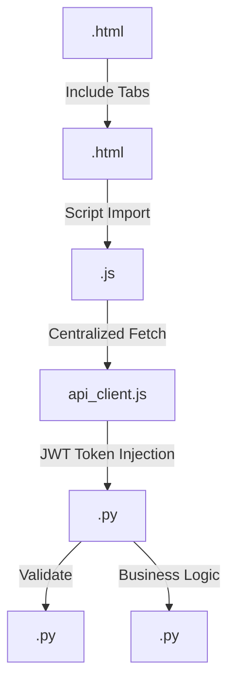

# 🗺️ Guía de Desarrollo: Arquitectura y Rutas

Este documento sirve como mapa técnico para desarrolladores. Explica dónde está cada recurso, cómo se relacionan los archivos y las reglas para editarlos.

---

## 🛤️ Mapa de Rutas (Endpoints)

### 📄 Páginas (Frontend - Jinja2)
Definidas en `main.py`:
- `/`: Landing Page (Inicio).
- `/perfil`: Portal del cliente (Gestión de vehículos y reservas).
- `/dashboard`: Panel administrativo (Control de cámaras y reportes).
- `/nuestra-red`: Mapa de sucursales.
- `/contacto`: Formulario corporativo.

### 🔌 API Endpoints (v1)
Los prefijos se definen en los routers dentro de `routes/`:
- `/v1/auth`: Login, Registro y validación de tokens.
- `/v1/user`: Datos del perfil, gestión de flota y reservas del cliente.
- `/v1/admin`: Operaciones de gestión global, usuarios y métricas.
- `/v1/parking`: Control de acceso (ALPR), apertura de barreras y sensores.
- `/v1/reports`: Generación de datos para gráficos y analítica financiera.
- `/v1/system`: Flujos de video y utilidades técnicas.

---

## 📂 Ubicación de Archivos Útiles

### 🖥️ Frontend (Interfaz)
- **Estructura HTML**: `templates/` (Usa herencia de `base.html`).
- **Dashboard Modular**: `templates/dashboard/tabs/` - Fragmentos por sección (`live.html`, `finance.html`, etc.).
- **Lógica de Negocio (JS)**: `static/js/`
    - `api_client.js`: **CRÍTICO** - Cliente centralizado para peticiones al backend.
    - `dashboard.js`: Lógica exclusiva del panel de administración (Charts, Monitoreo).
    - `perfil.js`: Hub de gestión del portal de usuario.
    - `reservas.js` y `vehicles.js`: Módulos de gestión de flota y estadías.
- **Estilos (CSS Modular)**: `static/css/`
    - `dashboard.css`: Estilos del "Command Center" (Grid de cámaras, KPIs, Charts).
    - `perfil-base.css`: Elementos comunes y layout de la zona privada.
    - `style.css`: Variables globales, fuentes y reset.

### ⚙️ Backend (Servidor)
- **Entrada**: `main.py` (Configuración de FastAPI y MQTT).
- **Controladores**: `routes/` (Segmentación por dominio).
- **Servicios**: `services/` (Lógica financiera en `billing_service.py`).
- **Validación/DLO**: `schemas.py` (Modelos Pydantic para la API).

---

## 🔗 Relaciones Críticas

---

## 🛠️ Reglas de Oro (Developer Guide)

### 🎨 Estilo y Visuales:
- **Montserrat**: Fuente principal obligatoria para toda la UI.
- **Glassmorphism**: Usar variables de `--border-light` y fondos `rgba(10, 10, 10, 0.8)`.
- **Dorado AutoPass**: `#C5A059` para iconos, botones primarios y resaltados.
- **Voseo**: Todo texto debe usar voseo argentino (Ej: "Cargá", "Tenés", "Registrate").

### 🧠 Lógica y Datos:
1.  **Centralización**: NUNCA hagas un `fetch` manual. Usá siempre `apiClient` para asegurar la inyección de tokens y manejo de errores.
2.  **Modularidad Dashboard**: Si añadís una sección al admin, creá un archivo en `templates/dashboard/tabs/` y vinculalo en `dashboard.html`.
3.  **Gráficos**: Siempre usá Chart.js siguiendo el estilo oscuro de `dashboard.js`. Destruí instancias previas antes de recrear gráficos.
4.  **Cálculos Financieros**: La única fuente de verdad es `services/billing_service.py`. No calcules deudas en el frontend.

### 🛡️ Seguridad y Backend:
- **Protección de Rutas**: Usar la dependencia `get_admin_user` para endpoints que requieran permisos elevados.
- **Esquemas**: Si añadís campos al backend, actualizá `schemas.py` para evitar errores de validación (Internal Server Errors).
- **Acceso Híbrido**: La validación de QR debe seguir el formato `AUTOPASS|ID:{id}|PLATE:{patente}` para ser procesada por el endpoint `/access/validate-qr`.
- **Workers de Fondo**: Cualquier tarea de mantenimiento periódico debe registrarse en `main.py` mediante hilos (`threading`) para no bloquear el bucle de eventos de FastAPI.

---
*Este documento es dinámico. Mantenelo actualizado tras cada refactorización importante.*
