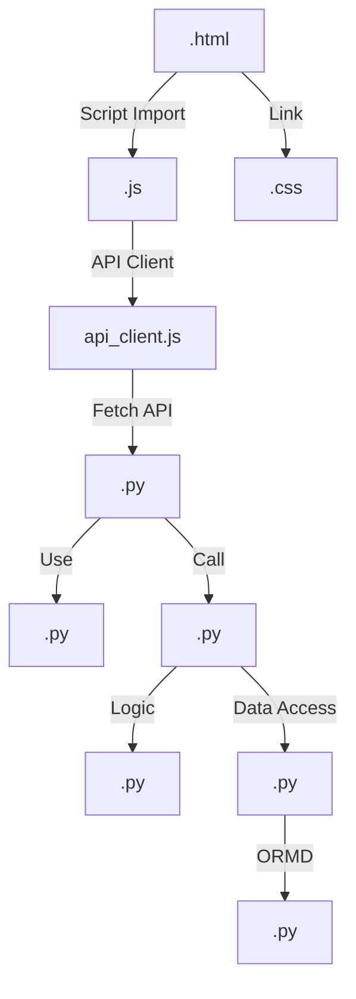

# 🗺️ Guía de Desarrollo: Arquitectura y Rutas

Este documento sirve como mapa técnico para desarrolladores. Explica dónde está cada recurso, cómo se relacionan los archivos y las reglas para editarlos.

---

## 🛤️ Mapa de Rutas (Endpoints)

### 📄 Páginas (Frontend - Jinja2)
Definidas en `main.py`:
- `/`: Landing Page (Inicio).
- `/perfil`: Portal del cliente (Gestión de vehículos y reservas).
- `/dashboard`: Panel administrativo (Control de cámaras y reportes).
- `/nuestra-red`: Mapa de sucursales.
- `/contacto`: Formulario corporativo.

### 🔌 API Endpoints (v1)
Los prefijos se definen en los routers dentro de `routes/`:
- `/v1/auth`: Login, Registro y validación de tokens.
- `/v1/user`: Datos del perfil, gestión de flota y reservas del cliente.
- `/v1/admin`: Operaciones de gestión global y métricas.
- `/v1/parking`: Control de acceso (ALPR), apertura de barreras y sensores.
- `/v1/reports`: Generación de datos para gráficos y analítica.
- `/v1/system`: Flujos de video y utilidades técnicas.

---

## 📂 Ubicación de Archivos Útiles

### 🖥️ Frontend (Interfaz)
- **Estructura HTML**: `templates/` (Usa herencia de `base.html`).
- **Lógica de Negocio (JS)**: `static/js/`
    - `main.js`: Funciones globales, sidebar y utilidades de fecha.
    - `reservas.js`: Creación, pago, modificación y visualización de reservas.
    - `vehicles.js`: CRUD de vehículos del usuario.
    - `auth.js`: Modales de login/registro.
- **Estilos (CSS Modular)**: `static/css/`
    - `style.css`: Estilos base, fuentes globales y fuentes maestras.
    - `landing.css`: Animaciones y diseño hero de la página de inicio.
    - `perfil-base.css`: Layout del portal, sidebar y elementos comunes del perfil.
    - `perfil-reservas.css`: Diseño premium del formulario de reserva y tarjetas activas.
    - `perfil-vehiculos.css`: Estilos de la flota y vinculación de patentes.
    - `perfil-ticket.css`: Estética exclusiva del Pase Digital con QR (Gold & Black).
    - `dashboard.css`: Estilos específicos del panel administrativo.
    - `modals.css`: Estilos para ventanas emergentes y diálogos.
    - `footer.css`: Diseño del pie de página premium.
    - `contacto.css` y `legal.css`: Estilos para páginas institucionales.

### ⚙️ Backend (Servidor)
- **Entrada**: `main.py` (Configuración de FastAPI y MQTT).
- **Controladores**: `routes/` (Segmentación por dominio).
- **Servicios**: `services/` (Lógica de negocio y reglas financieras).
- **Repositorios**: `repositories/` (Abstracción de consultas SQL).
- **Modelos de Datos**: `models.py` (Estructura de tablas SQL).
- **Validación/DLO**: `schemas.py` (Pydantic para entrada/salida de API).
- **Lógica de Cobro**: `services/billing_service.py` (Cerebro financiero).

---

## 🔗 Relaciones Críticas

1.  **Frontend -> Backend**: Los archivos `.js` se comunican con los `.py` en `routes/` mediante `fetch` usando la constante `API_BASE = '/v1'`.
2.  **HTML -> Layout**: Todas las páginas extienden de `base.html`. Para añadir scripts o estilos específicos, usar los bloques `` y ``.
3.  **Seguridad**: El archivo `auth.py` contiene los decoradores para proteger rutas. Para que una ruta sea privada, debe recibir `current_user: models.User = Depends(auth.get_current_user)`.

---

## 🛠️ Reglas para Editar (Developer Guide)

### 🎨 Si vas a editar el Estilo (CSS/HTML):
- **Herencia**: No repitas el Navbar o Footer, edita `base.html` si el cambio es global.
- **Tipografía**: Se utiliza **Montserrat** como fuente principal del sistema y **Inter** para textos de lectura larga.
- **Escala Tipográfica**: Usar siempre las variables de `:root` (`--text-xs` a `--text-xl`) para mantener la consistencia.
- **Voseo**: Todo texto debe usar voseo argentino (Ej: "Cargá tu saldo").
- **Glassmorphism**: En páginas públicas, usar `background: rgba(10, 10, 10, 0.85)` con `backdrop-filter: blur(25px)`.
- **Responsive**: 
    - Desktop: Sidebar de 240px (Perfil) / Header dinámico (Landing).
    - Móvil (< 1024px): Sidebar lateral izquierdo de 260px con Title Case y cabecera de marca.
    - Móvil (< 768px): Header centrado con menú hamburguesa flotante a la izquierda. Inputs de formulario a 100% de ancho.

### 🧠 Si vas a editar la Lógica (JS):
- **Nomenclatura**: Usar `camelCase` para funciones (Ej: `loadReservations`).
- **Feedback**: Siempre usá `showToast(mensaje)` para informar al usuario sobre éxitos o errores.
- **Token**: El token JWT está en `localStorage.getItem('token')` y debe enviarse en el header `Authorization: Bearer ...`.

### 🛡️ Si vas a editar el Backend (Python):
- **Nomenclatura**: Usar `snake_case` para funciones y variables (Ej: `crear_reserva`).
- **Base de Datos**: Si modificás `models.py`, debés ejecutar un script de migración o resetear la base con `reset_db.py` para aplicar los cambios.
- **Validación**: Cualquier dato que entre desde el frontend debe tener un schema en `schemas.py` para asegurar que sea válido.

### 📊 Si vas a editar Precios o Puntos:
- **Centralización**: Nunca calcules dinero fuera de `services/billing_service.py`. Esto asegura que si la tarifa cambia, cambie en todo el sistema a la vez.

---
*Este documento es dinámico. Mantenelo actualizado tras cada refactorización importante.*
